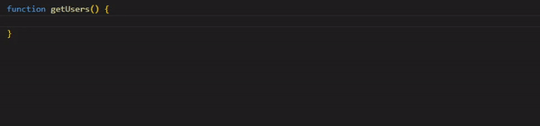

# axios-api-gen

[English](https://github.com/LaiJunBin/axios-api-gen#axios-api-gen)｜繁體中文

> 這個套件基於axios，可以從 path 定義生成 API，並且可以跟 mswx(mock service worker extension) 完美整合。

## 安裝
```
$ npm i axios-api-gen
```

## 基本使用

定義 endpoints (api.ts)
```ts
import { METHOD, generateApi, type Endpoints } from 'axios-api-gen';

const endpoints = {
	getUsers: '/users',
	createUser: {
		method: METHOD.POST,
		path: '/users'
	},
	updateUser: {
		method: METHOD.PATCH,
		path: '/users/:id'
	},
	deleteUser: '/users/:id'
};

// 型別檢查，非必要
const checkEndpoints: Endpoints = endpoints;

export default generateApi(endpoints);
```

基本使用:
```ts
import api from './api'
api.getUsers().then((res) => {
    console.log(res)
})
```

---

## 自動補齊



千萬不要在定義 endpoints 的時候直接給他帶入型別，這樣可能會導致你的 IDE 無法自動補齊，如果要型別檢查，請參考上方範例。

---

## generateApi options

他的介面定義如下
```ts
interface generateApiOptions {
  axiosInstance?: AxiosInstance
  beforeHandler?: () => void
  afterHandler?: () => void
}
```

### axiosInstance

你可以自訂 axios instance，例如:
```ts
import axios from 'axios';

const axiosInstance = axios.create({
	baseURL: import.meta.env.VITE_API_PREFIX,
	headers: {
		'Content-Type': 'application/json'
	}
});

// 略過 endpoints 定義

export default generateApi(endpoints, {
	axiosInstance
});
```

### beforeHandler

在發送 request 之前做的處理
```ts
export default generateApi(endpoints, {
	beforeHandler() {
		console.log('before');
	}
});
```

### afterHandler

request 完成後做的處理
```ts
export default generateApi(endpoints, {
	afterHandler() {
		console.log('after');
	}
});
```

---

## 與 mswx 整合

[mswx](https://www.npmjs.com/package/mswx) 是為 msw(mock service worker) 包裝的擴充套件，可以更方便使用，並且具有中介層(middleware)功能。

範例:

```ts
import api from '@/api';
import { rest } from 'mswx';

export const handlers = [
	rest.define(api.getUsers, async (req, res, ctx) => {
		return res(ctx.status(200));
	})
];
```

為什麼這樣可以運作?

因為實際上每一個 API 不只可以直接呼叫(call)以外，還有加入 method、path 兩個屬性，例如:

```ts
console.log(api.getUsers.method); // 輸出: GET
console.log(api.getUsers.path);   // 輸出: /users
```
